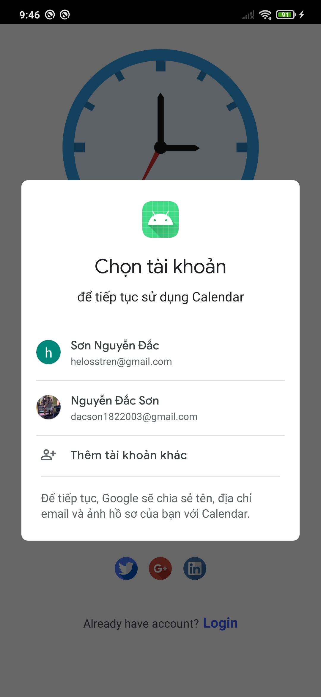

# 🔔 Notification App

Welcome to *Notification App*!  
An Android application designed to help users manage tasks, receive alerts, and stay organized with a clean user experience.

---

## 1. 📋 Overview

- **Project Name**: NotificationApp
- **Type**: Android Mobile Application
- **Purpose**: Provide a modern and efficient interface for managing personal schedules, tasks, and calendar events.
- **Architecture**: Architecture: MVC (Model - View - Controller)
- **Backend**: Firebase


---

## 🧰 Technologies Used

### 🔧 Core Technologies

| Technology               | Description                                                            |
|--------------------------|------------------------------------------------------------------------|
| Java                     | Primary language for Android development                               |
| MVC Architecture         | Structured separation of UI, logic, and model components               |
| Navigation Component     | Manages fragment transitions with navigation graph & Safe Args support |
| Loading State Management | Handled via `sealed class` and `StateFlow`                             |
| DataStore                | Modern key-value storage replacing SharedPreferences                   |
| Glide                    | Image loading and caching (e.g., user avatars)                         |

---

### 🔐 Authentication & User Management

| Technology                      | Description                                                                 |
|---------------------------------|-----------------------------------------------------------------------------|
| **Firebase Authentication**     | Secure login via email/password                                             |
| **Google Sign-In**              | OAuth login using Google accounts                                           |
| **Facebook Login**              | OAuth login using Facebook accounts                                         |
| **Email Verification**          | Sends verification email during registration                                |
| **Password Reset**              | Sends reset password link via email                                         |
| **Firebase FireStore Database** | Stores user profile data and tasks in cloud                                 |
| **Firebase Storage**            | Stores user-uploaded images (e.g., avatars)                                 |

---

## 3. 🔧 Installation Guide

*Requirements:*
* Android Studio Giraffe or later
* JDK 21 or above
* Stable Internet connection

**Steps:**
```sh
# Step 1: Clone the repository
git clone https://github.com/nguyendacson/AppMobileNotice.git

cd NotificationApp

# Step 2: Open in Android Studio

# Step 3: Sync Gradle and run the app
```

---

## 4. 📱 App Features & Screens

| Screen                 | Description                                                                 |
|------------------------|-----------------------------------------------------------------------------|
| 🔐 Login               | Allows existing users to log into their accounts                            |
| 📝 Signup              | Allows new users to create an account                                       |
| 🏠 Home                | Displays today's tasks and quick calendar overview                          |
| 🔥 Task Manager        | Shows all tasks (upcoming, completed, and missed)                           |
| 🎬 Add Task            | Allows user to create a new task with alarm and time settings               |
| 👤 Profile             | Displays user information and app preferences                               |
| 🖼️ Add Avatar Profile | Lets user upload or change their profile picture                            |
| 🔁 Reset Password      | Allows users to reset their password via email verification or old password |
| 🔓 Forgot Password     | Sends reset link to user’s email to recover password                        |


---

## 5. ▶️ How to Use

* Launch the app and sign in using your preferred method (Username, Gmail, or Facebook)
* Create a new task by tapping the ➕ **Add Task** button
* Set the task's time, details, and optional notifications
* View and manage your tasks from the 📋 **Task Manager** screen
* Edit or delete tasks as needed
* Go to 👤 **Profile** to update personal information, change avatar, or reset your password
* If you forget your password, use 🔑 **Forgot Password** to recover your account


---

## 6. 👨‍💻 Project Members & Acknowledgments

* *Developer*: Nguyễn Đắc Sơn
* *Email*: dacson1822003@gmail.com
* *Acknowledgment*: Special thanks to my internship mentors and reviewers for their valuable support and guidance throughout the project.


---
## 🖼️ Screenshots

### 🔐 Login Screens
- Username Login  
  
- Login via Gmail  
  
- Login via Facebook  
  

### 📝 Signup Screens
- Basic Signup  
  
- Signup via Gmail  
  
- Signup via Username  
  
- Signup via Facebook  
  

### 🔑 Forgot Password Screens
- Enter Email to Reset  
  
- Link Sent Confirmation  
  
- After Password Reset  
  

### 🏠 Home Screen
- Main Dashboard  
  

### 📋 Task Manager Screens
- No Tasks Yet  
  
- After Adding a Task  
   

### ➕ Add Task Screens
- Add Task Form  
  
- Set Task Time  
  
- Set Task Description  
  

### 👤 Profile Screens
- Main Profile  
  
- Add/Change Avatar  
  
- Reset Password (from Profile)  
  


